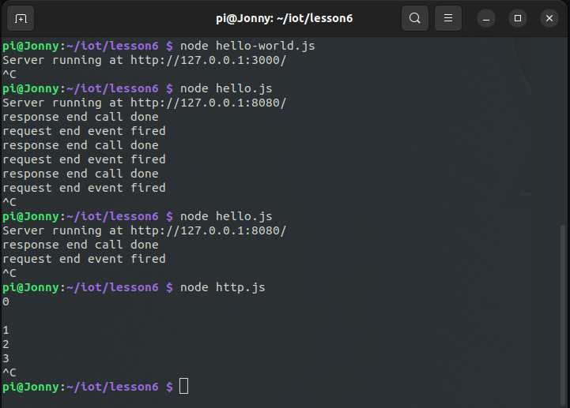
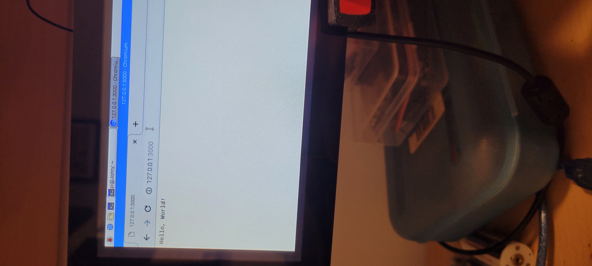
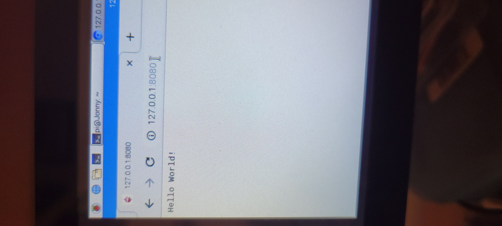
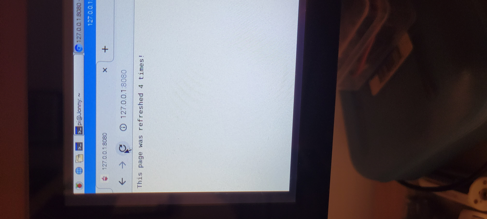
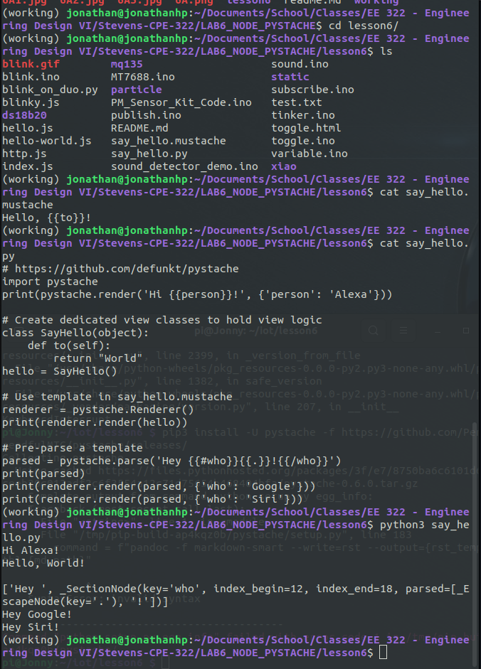

For this lab, pystache did not work on raspberry pi (running an old version of Raspberry Pi OS, I think that's the problem). The pystache part of the lab is done on my laptop instead 

Working folder is a virtual environment

